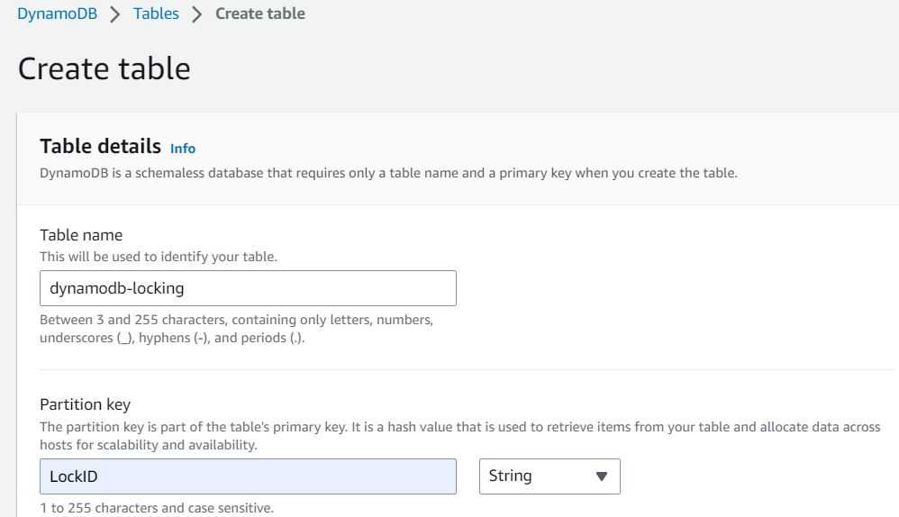
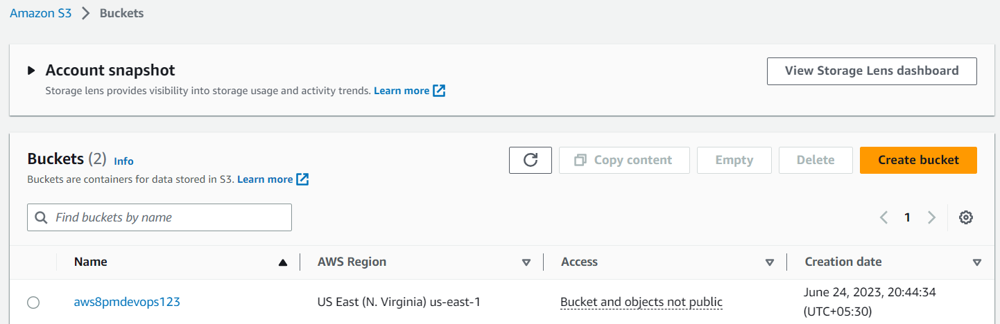
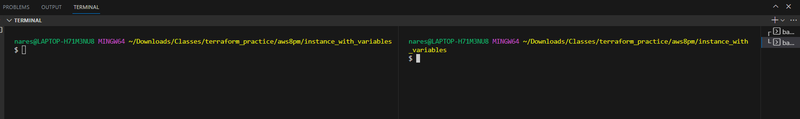
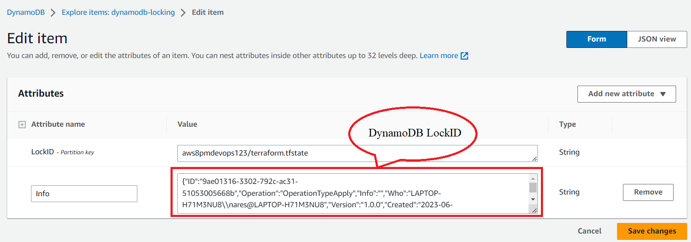
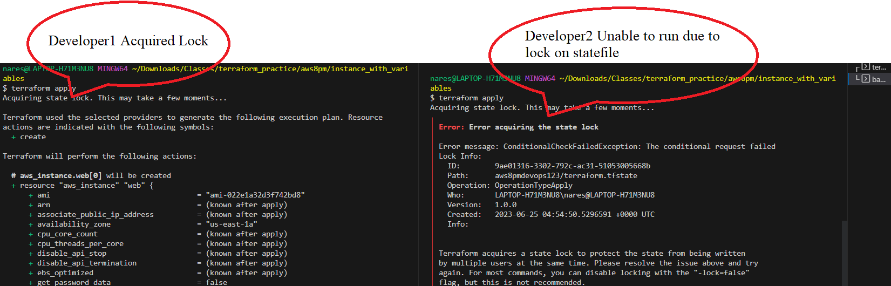

# Terraform Refresh

## Pre-Requisites:

```bash
Install Terraform
Create S3 Bucket
Create DynamoDB
```

## Create DynamoDB Table



## S3 Bucket


## Here is a state locking script

```terraform
terraform{
    backend "s3" {
        bucket = "aws8pmdevops123"
        encrypt = true
        key = "terraform.tfstate"
        region = "us-east-1"
        dynamodb_table  = "dynamodb-locking"
    }
}
```
## Open two termintals to understand about locking, each terminal using by different users


## Run below commands with developer1 adn developer2 respectively

```bash
terraform init
terraform plan
terraform apply
```

## Checking lock on DynamoDB


## Checking lock error in terminal


```Note:``` If second developer wants to run script, need to wait until lock to be release